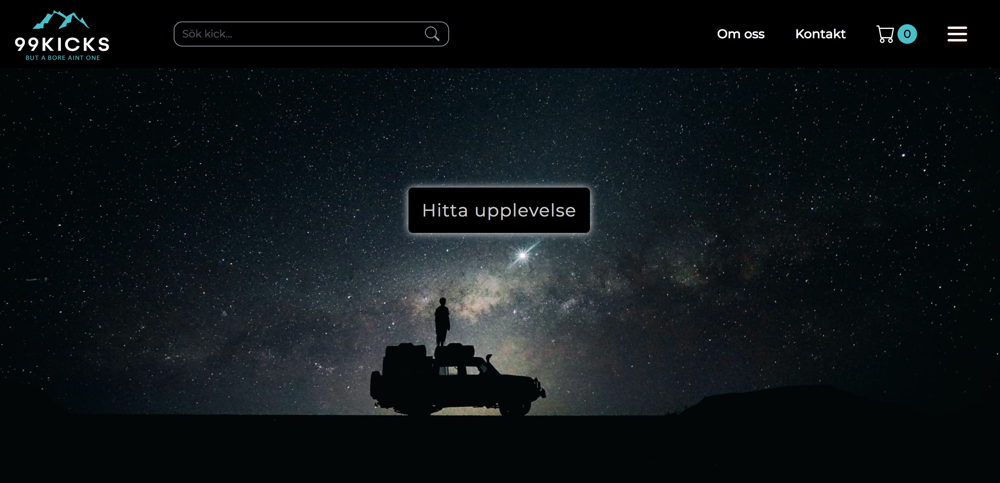

# Webshop - Experience gifts
School project built with TypeScript featuring basic functionality such as adding/removing items in shopping cart.

## Screenshot

## Installation
1. Clone the repo\
git clone https://github.com/michael-cwm/Grupparbete_JS

2. Install npm packages\
npm install

3. Run Parcel\
npm run build

Visit localhost:1234 to view the project

## Built with

- HTML
- SASS
- Parcel
- NPM
- TypeScript
- Bootstrap
- Mobile-first workflow

